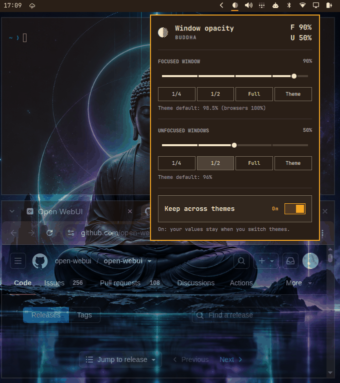

# Omarchy Opaque



Omarchy Opaque is a fork of [Omapaque](https://github.com/tomrplummer/omapaque)
by [Tom Plummer](https://github.com/tomrplummer). The original plugin is his
work. This repository keeps that MIT license, including his copyright, and
publishes the fork under its own plugin ID,
`io.github.richfeather-cpu.omarchy-opaque`.

This fork adds a few changes on top of upstream `main`:

- **Startup fix:** waits for the shell's saved settings before restoring
  opacity, so a shell restart no longer wipes a saved custom value.
- **Presets and a lower floor:** 1/4, 1/2, Full, and Theme presets; the minimum
  is 1% instead of 50%, with 1% scroll steps at or below 10%.
- **Separate focused and unfocused sliders:** the focused window and unfocused
  windows each get their own value. Only windows Omarchy itself makes
  translucent (the `default-opacity` tag and browsers) are affected.
- **Clearer persistence toggle:** "Keep across themes" shows On/Off in the theme
  accent colour, with a hint line underneath.

The same changes are also offered upstream. The original repository remains
https://github.com/tomrplummer/omapaque.

Omarchy Opaque adds exact window-opacity sliders to the Omarchy bar: one for
the focused window and one for unfocused windows. It reads the current theme's
Hyprland settings and starts each slider at the theme's own value (98.5%
focused and 96% unfocused on stock Omarchy), so nothing changes until you move
one. Personal and app-specific rules, such as a rule that keeps one terminal
opaque, do not replace the theme values shown by the sliders.

Each slider sets that exact opacity for its kind of window, and Hyprland
switches between the two automatically as focus moves. Fullscreen windows keep
the theme's fullscreen value. Setting a slider to 100% makes those windows
fully opaque, even when the theme has an opacity multiplier. By default,
switching themes removes the live override and reads the new theme's value. An
optional panel setting can reapply the custom value after Omarchy Opaque
records the new theme default. The compositor-side behavior is implemented as a
named Hyprland Lua window rule, so removing it reveals the theme's rule again.

## Switching from the original plugin

If you already use Tom Plummer's plugin (`tomrplummer.omapaque`), uninstall
that ID before installing this one. Widget settings are stored under the plugin
ID, so they do not carry over automatically. Set your opacity again after
installing.

```bash
omarchy plugin remove tomrplummer.omapaque --yes
omarchy plugin add https://github.com/richfeather-cpu/omarchy_opaque --enable
```

## Install

The Omarchy plugin command clones a Git repository. From inside this checkout,
run:

```bash
omarchy plugin add . --enable --yes
```

To install this fork from GitHub:

```bash
omarchy plugin add https://github.com/richfeather-cpu/omarchy_opaque --enable
```

`omarchy plugin add` clones the repository's default branch (`main`).

Omarchy places the widget in the right section by default. If needed, move it
with:

```bash
omarchy bar move io.github.richfeather-cpu.omarchy-opaque --section right
```

## Update

```bash
omarchy plugin update io.github.richfeather-cpu.omarchy-opaque --yes
```

The update command rescans installed plugins. If an update does not appear,
force another scan with `omarchy-shell shell rescanPlugins`. Restart the shell
only if the rescan does not work.

## Use

- Left-click opens the panel with the **Focused window** and **Unfocused
  windows** sliders.
- Scroll over the icon to change the unfocused opacity in 2.5% steps (1% steps
  at or below 10%, where small changes are visible).
- Presets under each slider jump to 1/4, 1/2, or Full opacity; **Theme** resets
  just that slider.
- Right-click a slider to reset only that slider. Right-click the bar icon to
  reset both to the theme values.
- In the panel, Left and Right adjust the selected slider. Up and Down move
  between the sliders and the persistence toggle. Enter activates the selected
  control.
- Turn on **Keep across themes** to reapply your chosen values after a theme
  change. The row shows On or Off in the theme accent colour, with a hint line
  underneath describing the current behaviour.

Choosing a value always keeps that exact compositor override, even when the
number matches the current theme value. Use reset when you want the theme to
control opacity again. Reset keeps the cross-theme preference enabled, so the
next custom value will also persist.

The lower limit is 1%. Very low values make windows nearly invisible; right-click
the icon or use the Full preset to recover. Omarchy Opaque applies
the chosen value to open windows and new windows. It only changes Hyprland's
live state. It does not edit theme files or files under `~/.config/hypr`.

Only windows that Omarchy itself makes translucent are affected: windows with
the `default-opacity` tag plus Chromium- and Firefox-based browsers. Browsers keep
Omarchy's own values (100% focused, 98.5% unfocused) until the matching slider is
moved, then follow it. Apps that Omarchy keeps solid, such as video players,
picture-in-picture, games, VMs, and the webcam overlay, are left alone.
Per-window toggles such as `Super + Backspace` still win. Reset restores
Omarchy's normal per-application rules.

The two values are saved separately in the widget settings (`opacityPercent` for
unfocused windows, `focusedPercent` for the focused window), under this plugin's
ID. The IPC target accepts `set`, `setFocused`, `resetUnfocused`,
`resetFocused`, and `reset`.

## Remove

```bash
omarchy plugin remove io.github.richfeather-cpu.omarchy-opaque --yes
hyprctl reload
```

Omarchy Opaque restores the theme opacity when it is disabled or removed. The
explicit Hyprland reload is a fallback in case removal interrupts the shell
cleanup.

## Requirements

- Omarchy 4.x
- Hyprland using Omarchy's Lua configuration
- Omarchy shell with bar-widget plugin support
- Bash, `jq`, and `flock`, which are included with Omarchy

Omarchy Opaque runs `hyprctl eval` to manage its temporary Lua window rule and
`hyprctl reload` when restoring theme control. It does not use `sudo`, edit
Hyprland configuration, start services, or access the network. Bash, `jq`, and
`flock` are the only external commands it needs, and they ship with Omarchy.

## Development

Validate the plugin and run its tests with:

```bash
omarchy plugin validate .
node test/run.js
lua test/lua_test.lua
```

Node.js and Lua are only needed to run the development tests.

## License

MIT. Original work copyright (c) 2026 Tom Plummer; modifications in this fork
copyright (c) 2026 Rich Feather. See [LICENSE](LICENSE).
